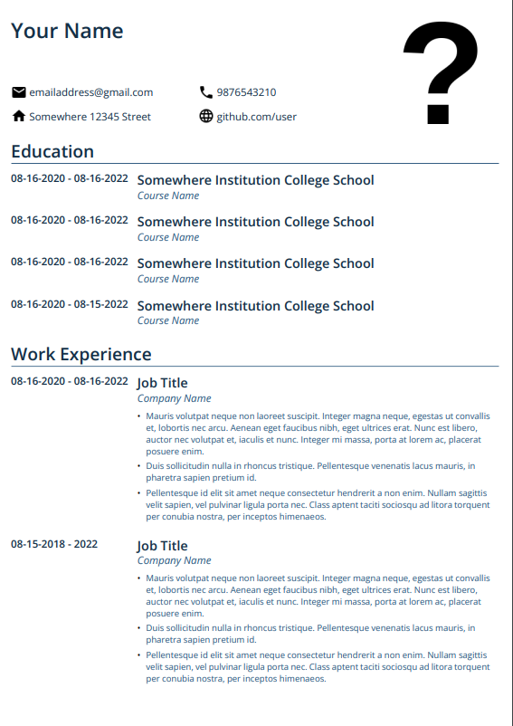
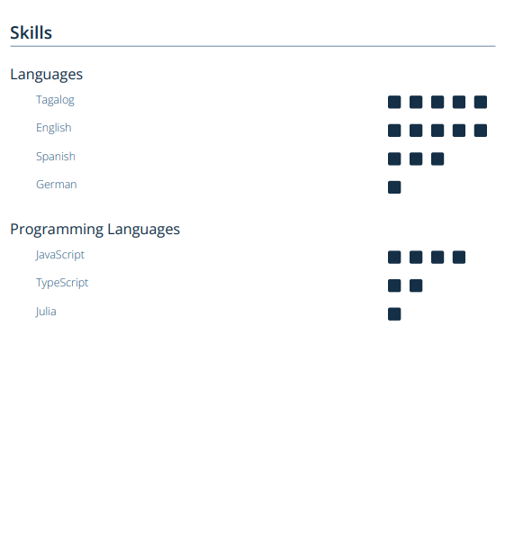

# CV Builder React App
Click [here](http://bbntpl.github.io/cv-builder/) to access live demo.

## Features
 - Creates a PDF file after submitting a form.
 - There at least 3 CV design options.
 - The required includes these categories: Basic Information, Education, Work Experience, and Skills.

## Framework used
- React hooks

## Library Used
- react-pdf/renderer

### Screenshots

